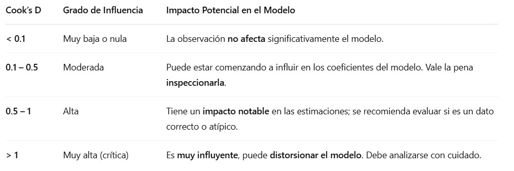
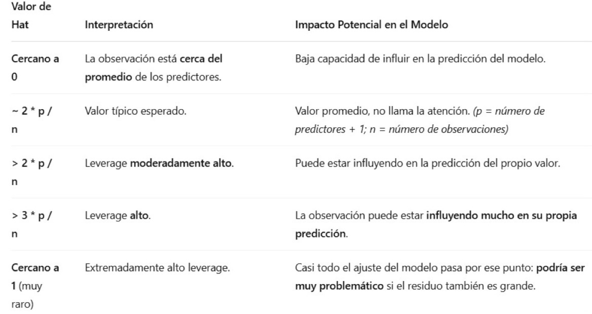
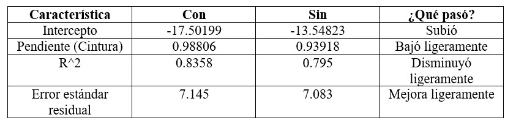

Cargamos librearías
```{r, warning=FALSE, message=FALSE}
library(readxl)
library(ggplot2)
library(dplyr)
library(gridExtra)  # Forma de organizar los gráficos.
library(GGally)
library(corrplot)
library(car)        # qqPlot de los residuales.
library(lmtest)     # Prueba de autocorrelación de DW y prueba de Breusch-Pagan
library(nortest)    # Prueba de KS
library(MASS)
library(caTools)    # sample.split
library(tseries)    # Prueba de Jarque Bera
```

Cargamos la base de datos
```{r}
Pulso <- read_excel("PulsoCardiacoMujeres.xlsx")
head(Pulso)
```

**Análisis Exploratorio**

Verificamos si tenemos la presencia de valores NA
```{r}
colSums(is.na(Pulso)) 
  # No hay presencia de valores NA
```

Realizamos un resumen de estadísticas descriptivas de la variable de interés.
```{r}
summary(Pulso$Cintura)
```
  
  - La mediana del contorno de la cintura es menor que la media, lo que sugiere una asimetría a la derecha.
  
  - El 25% de las mujeres de la muestra tienen una cintura mayor que 94.38
  
  - Existe una gran diferencia del contorno de la cintura entre el valor mínimo y el valor máximo.

Realizamos un boxplot y análisis de ouliers 
```{r}
boxplot(Pulso$Cintura) 
  # No hay presencia de outliers en la variable de interés.
boxplot.stats(Pulso$Cintura)
```

  - Tenemos el valor del bigote inferior = 66.70 que coincide con el valor mínimo de los datos porque no hubo outliers.
  
  - Tenemos el valor del bigote superior = 126.50 que coincide con el valor máximo de los datos porque no hubo outliers.
  
  - No hay presencia de outliers en los datos de 'Cintura'.

Matriz de correlaciones
```{r}
matriz_corr <- cor(select_if(Pulso, is.numeric))
  # Para filtrar del Dataset solo las variables Numericas. 
  # En este caso no tiene variables categoricas (texto) pero en caso de que tuviera la instruccion de arriba seria util.
  # Podria ser: matriz_corr <- cor(Pulso) y en este caso daria o mismo porque todas las variables son numericas en este caso.
matriz_corr
```
- Tenemos correlacion Cintura - Peso alta (trabajaremos con esta)
- Hay tambien una correlacion Cintura - Edad moderada alta.
- Hay tambien una correlacion Edad - Peso moderada.
  

Diagrama de calor para ver la matriz de correlaciones.
```{r}
corrplot(matriz_corr, method = "color", addCoef.col = "black")
  # addCoef.col = "black"  es para agregar el coeficiente de correlacion en color negro
  # 80 - 100 %  Correlacion Muy Alta
  # 60 - 80 %   Correlacion Alta
  # 30 - 60 %   Correlacion Moderada
  # 0 - 30 %    Correlacion Baja
```

  - Tenemos una correlación positiva muy fuerte entre la cintura y el peso de una mujer.
  
  - Tenemos una correlación positiva moderada entre las variables Peso - Edad y Cintura - Edad.
  
  - Tenemos una correlación positiva debil entre las demás variables.
  
  - No tenemos relaciones negativas o inversas.
  
  
Matriz de gráficos de dispersión ( x, y ) para cada par de variables
```{r}
pairs(Pulso, main = "Matriz de gráficos de dispersión", pch = 20, col =  "blue", lwd = 3)
  # 'pch = 20': plotting character. 20=bullet (smaller solid circle, 2/3 the size of 19)
```
  - Es clara la correlación positiva (lineal) entre el peso y la cintura de una mujer. Es la mas evidente.
  

Dado que Peso y cintura son los que tienen la mayor Correlacion y en la grafica de dispercion se ve la mayor relacion entonces,
usaremos Peso como variable respuesta (y) y a la Cintura como variable predictora (x) para el modelo de Regresion lineal.


Histogramas para cada variable (solo las numericas):
```{r}
variables <- c("Edad", "Estatura", "Peso", "Cintura", "Pulso")

par(mfrow = c(3, 2))
  # 3 filas, 2 columnas (ajustable)
  # Configura una ventana de gráficos (ajusta según el número de variables)

for (var in variables) {
  # Recorremos cada variable para graficarla
  datos <- Pulso[[var]] 
    # Dos corchetes para tener un arreglo de numeros. Un corchete saca un Dataframe con los datos de la variable. 
    # Necesitamos array de datos para el histograma que sigue:
  hist(datos, probability = TRUE, main = paste("Distribución de", var), xlab = var, col = "salmon1", breaks = nclass.Sturges(datos))
  lines(density(datos), col = "black", lwd = 3) 
    # EN COLOR NEGRO linea EMPIRICA, la de los datos.
  curve(dnorm(x, mean = mean(datos), sd = sd(datos)), add = TRUE, col = "blue", lwd = 3) 
    # EN COLOR AZUL linea DISTRIBUCION NORMAL, la Teorica. Para comparar si los datos obtenidos son normales.
}
# paste: Pegar un texto con un numero
```
Visualmente podemos ver que los datos de estatura son los que mayormente siguen una distribucion normal.


**Aplicación del Modelo**

Seleccionamos como nuestra variable de respuesta a "Peso" ("y") y nuestra variable predictora a "Cintura" ("x")

Dividir nuestros datos en datos de entrenamiento y datos de prueba. 
80% de los datos para Entrenar
20% de los datos para Probar
```{r}
set.seed(42)

# Barajeamos la base de datos, en caso de que la base de datos venga ordenada por algun criterio.
barajeo <- slice_sample(Pulso, prop = 1) 
  # "bareajear" una proporcion del 100% o sea a todas.
  # Slice sample toma una muestra aleatoria

# Dividimos aleatoriamente los datos en proporcion 80-20
split <- sample.split(barajeo$Edad, SplitRatio = 0.8) 
  # Se fija ($) cualquier variable, solo para que cuente el numero de elementos de la dataframe.
  # Crea un Vector lógico TRUE/FALSE aleatorio entre todos los elementos, 80% TRUE y 20% FALSE

# Base de entrenamiento
train <- subset(barajeo, split == TRUE)

# Base de Prueba o Testeo
test <- subset(barajeo, split == FALSE)
```


# MODELO

Ajustamos el MODELO con los datos de entrenamiento
```{r}
modelo <- lm(formula = Peso ~ Cintura, data = train) 
  # lm: linear model
  # Peso (y) se relaciona con Cintura (x)
summary(modelo)

```
Nota: Los Residuals son los errores $e$


El modelo ajustado es:
$$
\hat{y}=\hat{𝛽_0}+\hat{𝛽_1}x
$$

$$
\hat{Peso} = -17.50199 + 0.98806 *Cintura
\\{where: \hat{𝛽_0} = -17.50199 ,   \hat{𝛽_1} = 0.98806}
$$


**Elementos del Modelo:**

Test Fisher: 

(del summary de arriba)
F-statistic: 152.7 on 1 and 30 DF,  p-value: 2.669e-13

En regresión simple, el test F se utiliza para probar si el modelo con la variable explicativa $\hat{𝛽_1}$ es significativamente mejor que un modelo que solo incluye la media.

El juego de hipótesis (nula y alternativa) que se plantea es:
$$
H_0: \beta_1 = 0 \\
H_1: \beta_1 \neq 0
$$
   - Se busca que se rechace la Hipotesis Nula en favor de la alternativa, ya que arriba tenemos $\hat{𝛽_1}\neq 0$
  
   - suponemos un alpha 𝛼= 0.05 (nivel de significancia, o sea la probabilidad de cometer el Error tipo I)
  
   - Recordamos que si 𝑃≤𝛼, entonces se rechaza H_0
  
FISHER'S TEST

   - En el test de Fisher tenemos un p-value: 2.669e-13 < 0.05 se rechaza la hipótesis nula en favor de la alternativa. 
  
   - Existe suficiente evidencia estadística para sustentar la aseveración de que al menos una beta es diferente de cero, que en este caso es B_1 el coef. de la cintura.
   se dice "al menos una Beta" ya que esta generalidad aplica para un modelo de regresion multiple donde puede haber mas de una Beta. 

COEFICIENTES:

   - El p-valor de las variables "Cintura" e "Intercept" son menores que el nivel de significancia (alpha = 0.05), indicando que son significativas para el modelo.
  
   - Intersección (Intercept) = -17.50199: Cuando la variable Cintura = 0, el modelo predice que el peso sería aproximadamente -17.50199 kg. 
     Esta interpretación no tiene sentido práctico, ya que una cintura de 0 cm no es realista. Sin embargo, el intercepto es necesario para calcular los valores ajustados.
  
   - Pendiente (Cintura) = 0.98806: Por cada aumento de 1 cm en la cintura, el peso promedio aumenta en 0.98806 kg.

RESIDUALES:
   
   - Los resifuales son el Error entre la observacion real y la observacion estimada por el modelo dada por $\hat{y}=\hat{𝛽_0}+\hat{𝛽_1}x$

   - La mediana de los residuos 0.2585 es cercana a 0, lo cual sugiere que el modelo no tiene un sesgo fuerte en la predicción ya que el error típico está cercano a cero.
  
   - Aunque el modelo se ajusta bastante bien, hay algunos errores (residuos) un poco grandes.

R-SQUARED:
  
   - El modelo explica el 83.58% de la variabilidad en el peso usando la cintura como predictor. Esto indica un ajuste fuerte.
   
   - Se desea un valor alto de r-squared, sin embargo un valor ~100% podria causar Overfitting.
   
   - R-squared "measures the proportion of variance in the dependent variable explained by the independent variables in a regression model. R² always increases when more predictors are added
  
   - Adjusted R-squared es para modelos de regresion lineal multiple (con varias variables).
   
   - Adjusted R-squared is a modified version of R² that penalizes the addition of unnecessary independent variables. Adjusted R² only increases if the added predictor improves the model's fit significantly and may even decrease if the added predictor is not useful
  
  
```{r}
# Gráfico de dispersión con línea de regresión
plot(train$Cintura, train$Peso, col='blue3', pch = 16, xlab = "Cintura", ylab = "Peso", main = "Regresión Lineal: Peso ~ Cintura", lwd = 5)
abline(modelo, col='red', lwd = 2)
```

**Verificamos supuestos de e** 

1. $𝐸[𝑒_𝑖 ]=0$ es decir, la media de la distribución de probabilidad de 𝑒 es cero. 
2. $Var[𝑒_𝑖 ]=𝜎^2$ es decir, la varianza de la distribución de probabilidad de 𝑒 es constante. 
3. $𝑒_𝑖~𝑁(0,𝜎^2 )$ es decir, la distribución de probabilidad de 𝑒 es normal. 
4. Los errores asociados con dos observaciones diferentes son independentes. Que una observación no dependa de la otra, que no haya correlación entre ellas.

(Slide 9 : 11 - Regresión Lineal.pptx)


## 1. Media de los Residuales sea Cero

```{r}
mean(residuals(modelo))
  # La media de los residuales del modelo
```
El resultado es practicamente cero.


## 2. Homocedasticida (Igualdad de varianzas) 
La igualdad de varianzas se espera entre los residuos y los valores ajustados del modelo.
La varianza de la distribución de probabilidad de 𝑒 es constante. 

```{r}
plot(fitted(modelo), residuals(modelo), col = 'blue', pch = 16, main = 'Fitted vs Residuals')
  # Predicciones vs Residuales del modelo
abline(h=0, col='red')
  # fitted(modelo): Son los valores ajustados o predichos por tu modelo. 
  # residuals(modelo): Son los residuos.
```

  - Como los puntos están dispersos de forma aleatoria arriba y abajo de la línea roja y NO HAY PATRONES se sugiere que si hay homocedasticidad.

La Prueba de **Breusch-Pagan** es una prueba estadística que se utiliza para detectar la heterocedasticidad en un modelo de regresión lineal. La heterocedasticidad ocurre cuando la varianza de los errores o residuos no es constante a lo largo de las observaciones, lo que violaría una de las suposiciones básicas de los modelos de regresión lineal (homocedasticidad).

$H_0:$ La varianza de los errores es constante (homocedasticidad)
$H_1:$ La varianza de los errores no es constante (heterocedasticidad)

```{r}
bptest(modelo)
```

  - Como p-value = 0.1744 > 0.05 NO SE RECHAZA la hipótesis nula.
  
  - Existe suficiente evidencia estadística para sustentar la aseveración de que la varianza de los errores es constante.
   


# 3. Pruebas de Normalidad
```{r}
residuals(modelo)
  # Da los Errores (residuals) de la diferencia de los valores observados y predictos. Agregue esto solo para ver los datos.

# Histograma de los residuales
hist(residuals(modelo), probability = T,col='salmon', main='Histograma de residuos', breaks = nclass.Sturges(modelo$residuals))
lines(density(residuals(modelo)), col = "black", lwd = 3)
curve(dnorm(x, mean(residuals(modelo)), sd(residuals(modelo))), col = "red3", lwd = 3, add = T)
```

```{r}
# QQ-NORM
qqPlot(residuals(modelo), pch = 20, col = "black", lwd = 2)
  # Es una grafica que representa a los Quantiles teoricos (norm quantiles) Quantiles empiricos (observados) tambien representados por los puntos.
  # Entre mas se ajusten los valores observados a los Quantiles Teoricos (la linea recta azul) podremos decir que si hay una Normalidad en los datos.
  # Bandas de confianza.
  # If the data were perfectly normally distributed, all points would lie on the line. The further the data deviates from the line, the less normally distributed the data is.

```
Residual 8 y 13 pudieran ser residuales que pudieran ser influyentes en el modelo. Valores extremos o atipicos.
Siguen estando dentro de las bandas de confianza.


## Test de normalidad

In all of these tests, you are testing the null hypothesis $H_0$ that your data are normally distributed. 
The null hypothesis is that the frequency distribution of your data is normally distributed. 
To reject or not reject the null hypothesis, all these tests give you a p-value. 
What matters is whether this p-value is less than or greater than 0.05.

$H_0$ = Data are Normally distributed
$H_1$ = Data are NOT Normally distributed


                    Statistics  p-Value
Kolmogorov-Smirnov  0.09        0.892     # >= 50 datos (por las colas pesadas)
Shapiro-Wilk        0.98        0.862     # Cuando la muestra no es grande, <=50 datos
Anderson-Darling    0.24        0.772

p-Value smaller than 0.05?

  Yes: Normal distribution is not assumed. Se rechaza la hipotesis nula: H_0 = Normally distributed
  No: Normal distribution is assumed. NO se rechaza la hipotesis nula: H_0 = Normally distributed
  
### Test de normalidad de Shapiro

```{r}

shapiro.test(residuals(modelo)) 
  # Para ver si hay normalidad en los residuales.
  # W: es estadistico de prueba, usar Tablas.
  # p-value: comparar contra alpha (significancia o probabilidad de cometer Error tipo I)
```

  - Como p-value = 0.6137 > 0.05 NO se rechaza la hipótesis nula.
  
  - Existe suficiente evidencia estadística para sustentar la aseveración de que los residuales siguen una distribución significativamente normal.
  
### Test de normalidad de Jarque-Bera (forma)

  El test de **Jarque Bera** es una prueba de normalidad (enfocada en la forma) que evalúa si una muestra de datos (en este caso, los residuos del modelo) tiene una asimetría (skewness) y una curtosis (kurtosis) cercanas a las de una distribución normal.

  Skewness: Valor de referencia cero(mediana = media). Si sale Negativo tenemos sesgo a la izquierda y si sale positiva el sesgo es a la derecha.
  Kurtosis: Valor de referencia cero (Mesokurtica). Platokurtica, Mesokurtica y Leptokurtica (de menos a mas elevacion)
 

$H_0:$ Los residuos siguen una distribución normal (sin sesgo ni curtosis excesiva)
$H_1:$ Los residuos no siguen una distribución normal (pueden tener sesgo y curtosis fuera de los parámetros normales)

```{r}
jarque.bera.test(residuals(modelo))
```

  - Como p-value = 0.652 > 0.05 no se rechaza la hipótesis nula, 
  
  - Existe suficiente evidencia estadística para sustentar la aseveración de que los residuos siguen una distribución normal.
  
  


## 4. Uno de los supuestos del modelo de regresión lineal es que los residuos deben ser independientes entre sí. 

La prueba de **Durbin-Watson** evalúa si existe autocorrelación de primer orden en los residuos del modelo de regresión, es decir, si los errores están correlacionados entre sí (especialmente entre un error y el anterior).

El estadístico de Durbin Watson toma valores entre 0 y 4:
  
  - DW ≈ 2 → No hay autocorrelación (margen de +/-0.5)   <- Esto es lo que queremos.
  
  - DW < 2 → Autocorrelación positiva
  
  - DW > 2 → Autocorrelación negativa
  
 Prueba de Durbin-Watson para autocorrelación de residuos
 $H_0$: No hay autocorrelación en los residuos (es decir, los residuos son independientes entre sí). <- esto es lo que queremos, no rechazar H_0
 $H_1$: Sí hay autocorrelación en los residuos

```{r}
# Prueba de Durbin-Watson para autocorrelación de residuos
dwtest(modelo)
```
 
  - Como DW = 2.2082 lo cual está muy cerca de 2, entonces no hay evidencia de autocorrelación significativa. Esto indica que los errores del modelo son independientes entre si.
  
  - p-value = 0.7528 > 0.05 alpha, NO se rechaza la hipotesis nula, por lo tanto NO hay autocorrelación en los residuos. Esto indica que los errores del modelo son independientes entre si.
  
  
  
  
**Predicciones**
  
```{r}
# Predicciones con el conjunto de prueba "test"
predicciones <- predict(modelo, newdata = test, interval = "confidence", level = 0.95)
  # al ser valores continuos tienen tambien un intervalo de confianza
predicciones

# Agregar las predicciones (fit) y los intervalos de confianza (lower, upper) al conjunto de prueba "test"
test$predicted <- predicciones[,1]
test$lower <- predicciones[,2]
test$upper <- predicciones[,3]

# Ver el conjunto de prueba con las nuevas columnas de predicciones
test
```
Observar como el Peso=42.4 no cae dentro del intervalo de confianza (al 95%) (lower - upper), ademas, observar como la prediccion de agrega varios kg de mas al valor real observado.


**Valores Influyentes**






Los valores influyentes afectan afectan al modelo, es decir a las Betas. 
Ejemplo de valor influyente podria ser una cintura pequenia y un peso alto y viceversa, una cintura grande y un peso alto, son valores no concordantes.


Columnas del output:

dfb.1_: Este valor muestra el cambio en el coeficiente estimado para la variable independiente "Cintura" si se elimina la observación en cuestión. Si es muy grande (por ejemplo, mayor que 1), puede indicar que esa observación tiene un efecto fuerte sobre el modelo.

dfb.Cntr: Similar al anterior, pero para el intercepto. Nos dice cómo cambia el intercepto del modelo si eliminamos la observación correspondiente.

dffit: Este valor es una medida de cuán "lejana" está una observación de la predicción ajustada para su valor. Un valor alto de dffit indica que esa observación puede estar alejándose de la relación general del modelo. Valores mayores a 2 o 3 suelen ser motivo de preocupación.

cov.r: Esta columna mide el cambio en la covarianza del modelo cuando se elimina una observación. Un valor cercano a 1 sugiere que la observación tiene un fuerte impacto en la covarianza.

cook.d: El estadístico de Cook o distancia de Cook (cook.d) es una medida que evalúa la influencia de una observación en el modelo de regresión en general. Básicamente, mide cuánto cambiarían los resultados del modelo si esa observación fuera eliminada. Si el valor de Cook es grande (generalmente mayor que 1), indica que esa observación tiene un gran impacto en los resultados del modelo y podría ser considerada influyente. 

hat: La palanca (hat) o Leverage, mide cuán influyente es una observación en la predicción de su propio valor dentro del modelo. Si una observación tiene una palanca alta, significa que un pequeño cambio en esa observación podría afectar mucho su propia predicción, lo que indica que tiene un impacto considerable en cómo el modelo la interpreta. Esto también puede influir indirectamente en las predicciones de otras observaciones, ya que cambia la forma en que el modelo ajusta su estructura general.


```{r}
# Evaluamos los valores influyentes
influencia <- influence.measures(modelo)

# Mostramos las medidas de influencia
summary(influencia)

# Para identificar puntos con alta influencia, se puede filtrar:
influencia$summaries[which(influencia$summaries$cook.d > 1),]
```
Analisis de cook.d y hat para cada valor influyente:

Observación 8:

  - coock.d = 0.07. Esto es un valor bajo y no tiene un gran impacto en la estimacion del modelo. 
    Si por ejemplo hubiera sido de 0.80, Esto si seria un valor elevado. 
    El estadístico de Cook mayor que 1 indica que la observación podría tener un gran impacto en la estimación del modelo.

  - hat = 0.03: Esto indica que la observación NO tiene una gran influencia en la predicción de su propio valor.

Observación 11:

  cook.d = 0.00: EEsto es un valor bajo y no tiene un gran impacto en la estimacion del modelo.

  hat = 0.22: Este valor de "hat" es relativamente alto, lo que indica que esta observación SI tiene una gran influencia sobre las predicciones.

Observación 13:

  - cook.d = 0.17: Este valor es bajo, lo que sugiere que esta observación no tiene una gran influencia en el modelo.

  - hat = 0.05: O Leverage. Este valor también es bajo, lo que indica que la observación no tiene una gran influencia sobre la predicción de su propio valor.

Observación 26:

  - cook.d = 0.22: Esto es un valor bajo y no tiene un gran impacto en la estimacion del modelo. 

  - hat = 0.22: Similar a la observación 11, esta observación tiene una alta influencia sobre las predicciones.

```{r}
# Graficar influencia
plot(modelo, which = 4:5)
  # 4: grafico de "Cook's distance"
  # 5: grafico de "Residuals vs Leverage"
```

  Del grafico de Cook's Distance:
  
  - Los valores 2, 13 y 26 pueden ser influyentes para el modelo.

  Del grafico de Residuals vs Leverage(hat):
  
  - Quisieramos que la linea roja fuera plana, paralela a cero.
  
  - La mayoría de los puntos (obsrvaciones) están concentrados en el centro.
  
  - El punto 26 tiene un leverage alto lo que puede estar influenciando mucho en la forma del modelo.
  
  - El punto 2 y 13 tienen un residuo grande aunque con leverage bajo. Podríamos sugerir que el modelo no los predijo bien.
  
```{r}
# Ver de la base de datos "modelo" las obsevaciones 2, 13 y 26
train[c(2,13,26),]
```
Ver los resultados de Peso vs Cintura, si parecen valores atipicos, i.e. cintura 104.7 pero peso unicamente de 73.4. Y asi para las otras dos observaciones.


#**Modelo 2**

Probamos el modelo sin la observación 26
```{r}
train2 <- train[-26,]
```


Ajustamos el modelo con los datos de entrenamiento (sin la observacion 26)

Nuevo modelo: modelo2

```{r}
modelo2 <- lm(Peso ~ Cintura, data = train2)
summary(modelo2)
```
   - R-squared "measures the proportion of variance in the dependent variable explained by the independent variables in a regression model. R² always increases when more predictors are added
  
   - Adjusted R-squared es para modelos de regresion lineal multiple (con varias variables).
   
   - Adjusted R-squared is a modified version of R² that penalizes the addition of unnecessary independent variables. Adjusted R² only increases if the added predictor improves the model's fit significantly and may even decrease if the added predictor is not useful
   
   
   
El modelo ajustado es:
$$
\hat{Peso} = -13.54823 + 0.93918 *Cintura
$$



  - La observación 26 era influyente ya que su presencia hacía que el intercepto fuera más bajo.
  
  - El coeficiente de cintura cambió moderadamente, pero relevante si usas el modelo para predicciones.
  
  - el p-value de "Intercept" es 0.0899 > alpha, mientras que el de "Cintura" es 1.72e-11 < alpha.
  
  - La observación 26 ayudaba a que el modelo explicara el R^2 = 83.56% de la variabilidad y sin él baja al R^2 = 79.5%.
  
  - En conclusión, la observación 26 si es influyente ya que al quitarla el modelo cambia pero no se destruye y el ajuste sigue siendo bueno pero un poco menos explicativo.

  - En el test de Fisher tenemos un p-value: 1.718e-11 < 0.05 se rechaza la hipótesis nula en favor de la alternativa. Es decir, tenemos al menos una beta diferente de cero.

```{r}
# Gráfico de dispersión con línea de regresión
  # base de datos train2 (sin la observacion 26)
plot(train2$Cintura, train2$Peso, col='blue3', pch = 16, xlab = "Cintura", ylab = "Peso", main = "Regresión Lineal: Peso ~ Cintura", lwd = 5)
abline(modelo2, col='red', lwd = 2)
```

**Verificamos supuestos de e**

Pruebas de Normalidad

```{r}
# Histograma de los residuales
hist(residuals(modelo2), probability = T,col='salmon', main='Histograma de residuos', breaks = nclass.Sturges(modelo$residuals))
lines(density(residuals(modelo2)), col = "black", lwd = 3)
curve(dnorm(x, mean(residuals(modelo2)), sd(residuals(modelo2))), col = "red3", lwd = 3, add = T)
```

```{r}
# QQ-NORM
qqPlot(residuals(modelo2), pch = 20, col = "black", lwd = 2)
```

```{r}
# test de normalidad
shapiro.test(residuals(modelo2)) # Si hay normalidad en los residuales.
```

  - Como p-value = 0.2991 > 0.05 no se rechaza la hipótesis nula.
  
  - Existe suficiente evidencia estadística para sustentar la aseveración de que los residuales siguen una distribución significativamente normal.

Homocedasticida (Igualdad de varianzas): La igualdad de varianzas se espera entre los residuos y los valores ajustados del modelo.
```{r}
plot(fitted(modelo2), residuals(modelo2), col = 'blue', pch = 16, main = 'Fitted vs Residuals')
abline(h=0, col='red')
```

  - Como los puntos están dispersos de forma aleatoria arriba y abajo de la línea roja y no hay patrones se sugiere que si hay homocedasticidad.

La Prueba de **Breusch-Pagan**
$H_0:$ La varianza de los errores es constante (homocedasticidad)
$H_1:$ La varianza de los errores no es constante (heterocedasticidad)

```{r}
bptest(modelo2)
```

  - Como p-value = 0.1898 > 0.05 no se rechaza la hipótesis nula.
  
  - Existe suficiente evidencia estadística para sustentar la aseveración de que la varianza de los errores es constante.
  

El test de **Jarque Bera**
$H_0:$ Los residuos siguen una distribución normal (sin sesgo ni curtosis excesiva)
$H_1:$ Los residuos no siguen una distribución normal (pueden tener sesgo y curtosis fuera de los parámetros normales)

```{r}
jarque.bera.test(residuals(modelo2))
```

  - Como p-value = 0.3491 > 0.05 no se rechaza la hipótesis nula, 
  
  - Existe suficiente evidencia estadística para sustentar la aseveración de que los residuos siguen una distribución normal.
  

La prueba de **Durbin-Watson**

  - DW ≈ 2 → No hay autocorrelación
  
  - DW < 2 → Autocorrelación positiva
  
  - DW > 2 → Autocorrelación negativa
  
$H_0:$ true autocorrelation is = 0
$H_1:$ true autocorrelation is > 0
  
```{r}
dwtest(modelo2)
```
 
  - Como DW = 2.1106 lo cual está muy cerca de 2, entonces no hay evidencia de autocorrelación significativa. Esto indica que los errores del modelo son independientes.
  
  - p-value es 0.6448 > alpha, NO se rechaza la hipotesis nula, no hay autocorrelacion.
  
Promar el modelo 2

```{r}
# Predicciones en el conjunto de prueba 2 (test2 = test sin observacion 26 en este caso)
test2 <- test[,c(1:5)]
  # columnas 1 a 5 porque son las columnas originales del dataset, antes de que agregaramos la de predicted, lower y upper.
predicciones2 <- predict(modelo2, newdata = test2, interval = "confidence", level = 0.95)

# Guardar las predicciones y los intervalos de confianza en el conjunto de prueba
test2$predicted <- predicciones2[,1]
test2$lower <- predicciones2[,2]
test2$upper <- predicciones2[,3]

# Ver el conjunto de prueba con las nuevas columnas de predicciones
test
test2
```

Comparando los resultados de test y test2 vemos que dan valores similares.