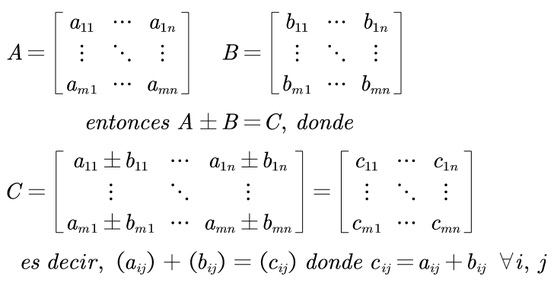

## Matrices

Una matriz en R es una estructura de datos bidimensional para almacenar objetos del mismo tipo. 

Para crear una matriz se utiliza la función matrix() cuyos argumentos son:

  1. data: Datos a incluir en la matriz
  2. nrow: Número de filas
  3. ncol: Número de columnas
  4. byrow: Llenado por filas o columnas TRUE o FALSE respectivamente. Por defecto es FALSE es decir, se va llenando por columnas. 
  5. dimnames: Nombres de las filas y columnas. 

```{r}

# Creamos una Matriz

secuencia1 = 1:15
matriz1 = matrix(data = secuencia1, nrow = 3, ncol = 5)
matriz1

matriz2 = matrix(data = secuencia1, nrow = 3, ncol = 5, byrow = TRUE)
matriz2

set.seed(42)
vector1 = round(runif(n = 12, min = -5, max = 5),0)
vector1

matriz3 = matrix(vector1, 3, 4, T, dimnames = list(c("F1", "F2", "F3"), c("C1", "C2", "C3", "C4")))
matriz3
```


## Operaciones con matrices


# link image: https://jcastrom.jimdofree.com/matematica/algebra-lineal/operaciones-con-matrices/

Suma y Resta de Matrices:

```{r}
matrizA = matrix(1:4, 2, 2, dimnames = list(c("F1", "F2"),c("C1", "C2")))
matrizA

matrizB = matrix(5:8, 2, 2, dimnames = list(c("F1", "F2"),c("C1", "C2")))
matrizB

matriz_suma = matrizA + matrizB
matriz_suma

matriz_resta = matrizA - matrizB
matriz_resta

```

Producto de matrices: Diferencia entre multiplicación elemento a elemento (producto punto) y 
multiplicación matricial.

```{r}
print("Producto puno *")
producto_punto = matrizA * matrizB # Elemento a elemento
producto_punto
print("Multiplicacion %*%")
matriz_multiplicacion = matrizA %*% matrizB
matriz_multiplicacion
```

Transpuesta, Determinante e Inversa de una Matriz

```{r}
print("matrizA")
matrizA

print("Transpuesta")
matriz_transpuesta = t(matrizA) # Intercambia filas por columnas
matriz_transpuesta

print("Determinante matrizA")
detA = det(matrizA)  # (1*4)-(2*3) = -2
detA
print("Determinante matrizB")
detB = det(matrizB)
detB

print("Inversa")
inversaA = solve(matrizA)  # A⁻¹ = (1/|A|) * adj(A)
inversaA

```
```{r}
#install.packages("matlib")
library(matlib)

Inverse(matrizA, verbose = T)
```

## Funciones aplicadas a matrices

Uso de las funciones rowSums(), colSums(), rowMeans() y colMeans() para obtener estadísticas de filas y columnas.

```{r}
matrizA

rowSums(matrizA)

colSums(matrizA)

rowMeans(matrizA)

colMeans(matrizA)
```

## Actividad 1

Eres un analista en una compañía de seguros y debes evaluar la rentabilidad de dos productos de inversión.

Productos:

  Producto A: Tasa de interés anual del 1.5%, 2% y 2.5% para los años 1, 3 y 5 respectivamente.
  Producto B: Tasa de interés anual fija del 3%, 3.5% y 4% para los años 1, 3 y 5 respectivamente.

Plazos de Inversión:

  1 año, 3 años y 5 años.

Objetivos:

  1. Calcular el valor futuro de una inversión inicial de $10,000 para ambos productos en cada plazo.

  2. Comparar la rentabilidad utilizando gráficos.

```{r}
tasas_interes = matrix(data = c(1.5, 2, 2.5, 3, 3.5, 4), nrow = 2, ncol = 3, byrow = TRUE)
colnames(tasas_interes) = c("1 año", "3 años", "5 años")
rownames(tasas_interes) = c("Producto A", "Producto B")
tasas_interes

capital_inicial = 10000
valor_futuro = capital_inicial*(1+tasas_interes/100)^c(1,3,5)
valor_futuro

```


## Actividad 2

Eres un analista financiero de una concesionaria de autos y te han solicitado realizar un análisis detallado de los pagos mensuales de diferentes modelos de autos bajo diversos planes de financiamiento. 
La concesionaria ofrece financiamientos a plazos de 36, 48, 60 y 72 meses, con tasas de interés anuales que varían según el modelo de auto.

Se tiene tres modelos con los siguientes precios:
  Modelo A $250,000
  Modelo B $350,000
  Modelo C $450,000

Tasas de interés anual para cada modelo (capitalizables mensualmente)
  Modelo A 7.5%
  Modelo B 6.5%
  Modelo C 5.5%

Plazos de financiamiento
  36 meses
  48 meses
  60 meses
  72 meses
  
  1. Utiliza la fórmula de anualidades para calcular los pagos mensuales. 
  2. Crea una matriz que almacene los pagos mensuales calculados para cada modelo de auto y cada plazo.
  3. Utiliza ggplot2 para crear un gráfico que muestre los pagos mensuales en función del plazo para cada modelo de auto.

```{r}
precios = c(250000, 350000, 450000)
tasas_anuales = c(7.5, 6.5, 5.5) / 100
plazos = c(36, 48, 60, 72)

tasas_capitalizables =  round(tasas_anuales/12, 3) # Tasas Mensuales porque los periodos son mensuales (Mensualidades)
tasas_capitalizables

plazos_matriz = matrix(data = rep(plazos, each = 3), nrow = 3, byrow = FALSE)
colnames(plazos_matriz) = c("36 meses", "48 meses", "60 meses", "72 meses")
rownames(plazos_matriz) = c("Modelo A", "Modelo B", "Modelo C")
plazos_matriz

tasas_matriz = matrix(data = rep(tasas_capitalizables, each = 4), nrow = 3, byrow = TRUE)
colnames(tasas_matriz) = c("32 meses", "48 meses", "60 meses", "72 meses")
rownames(tasas_matriz) = c("Modelo A", "Modelo B", "Modelo C")
tasas_matriz

precios_matriz = matrix(data = rep(precios, each = 4), nrow = 3, byrow = TRUE)
colnames(precios_matriz) = c("32 meses", "48 meses", "60 meses", "72 meses")
rownames(precios_matriz) = c("Modelo A", "Modelo B", "Modelo C")
precios_matriz


pagos_mensuales = (precios_matriz * tasas_matriz) / (1 - (1 + tasas_matriz) ^ (-plazos_matriz))  # R = (VP * i) / (1 - (1 + i)^-n)
colnames(pagos_mensuales) = c("32 meses", "48 meses", "60 meses", "72 meses")
rownames(pagos_mensuales) = c("Modelo A", "Modelo B", "Modelo C")
pagos_mensuales
```


## Índices con matrices

Los índices en matrices son utilizados para acceder, modificar, o extraer elementos específicos dentro de la matriz. Los índices en R funcionan de la siguiente manera:

Para acceder a un elemento específico de una matriz, se usa la notación [fila, columna].

```{r}
# Datos de la primera fila y segunda columna
pagos_mensuales
pagos_mensuales[1,2]

```

Para acceder a toda una fila, se deja en blanco la parte del índice de la columna: 

```{r}
pagos_mensuales[2,]
```

Para acceder a toda una columna, se deja en blanco la parte del índice de la fila:

```{r}
pagos_mensuales[,4]
```

Imaginemos que después de calcular los pagos mensuales, la gerencia quiere responder algunas preguntas específicas:

  1. ¿Cuál es el pago mensual del Modelo B para un plazo de 48 meses?

```{r}
pagos_mensuales[2,2]
cat("El pago mensual del modelo B para un plazo de 48 meses es: $", pagos_mensuales[2,2])
```

  2. ¿Cuáles son los pagos mensuales para todos los modelos cuando el plazo es de 60 meses?

```{r}
pagos_mensuales[,3]

```

  3. ¿Cuáles son los pagos mensuales para el Modelo C en todos los plazos?

```{r}
pagos_mensuales[3,]
```

