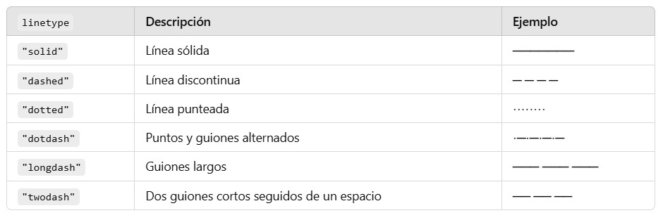
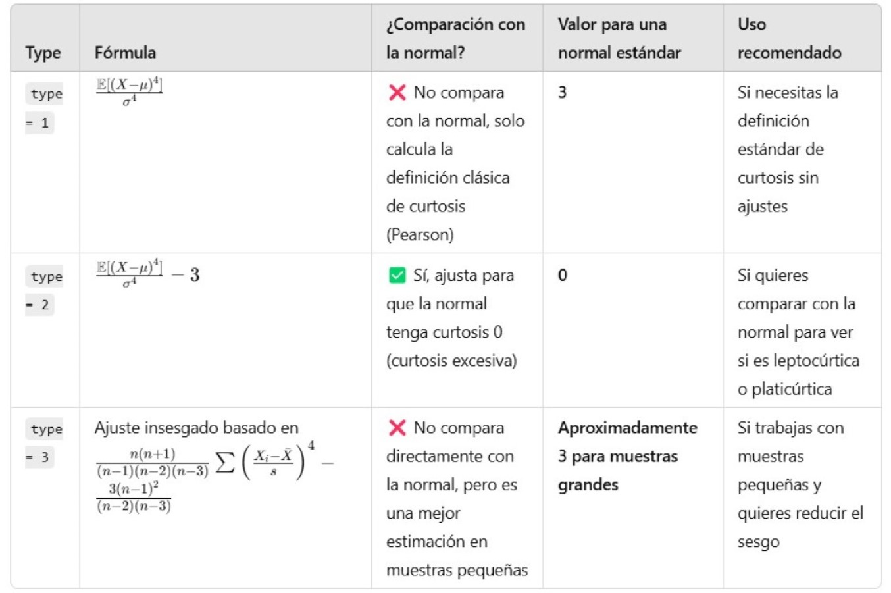
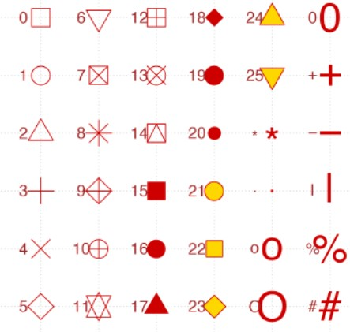

Cargamos librerías
```{r, message=FALSE, warning=FALSE}
library(readxl)
library(ggplot2)
library(patchwork) # Mejor visualizacion de las graficas, juntar las Graficas en una sola Vista
library(dplyr) # Manipular con Data Frames
library(moments) # Para calcular la asimetría
library(e1071) # Curtosis
```

Importamos la base de datos
```{r}
asegurados <- read_excel("expenses.xlsx")
head(asegurados)
```
Ver si hay NA
```{r}
colSums(is.na(asegurados))
```
Ver tipos de variables
```{r}
glimpse(asegurados)
```

Realizamos un histograma de frecuencias para cada variable Numérica
```{r}
hist(x = asegurados$age, #vector numérico 
     main = "Frecuencia Edad Asegurados", # Título principal
     xlab = "Edad", # Título del eje x
     ylab = "Frecuencia", # Título del eje y
     col = "ivory", # Dar color a las barras
     border = "darkblue", # Color para los bordes de las barras
     labels = TRUE, # Mostrar etiquetas
     ylim = c(0,200), # Ajustar los límites del eje y
     cex.main = 1.5, # tamanio de letra en el main
     cex.lab = 1.2) # tamanio de los lables

hist(x = asegurados$bmi, 
     main = "Frecuencia BMI Asegurados", 
     xlab = "IMB", 
     ylab = "Frecuencia", 
     col = "ivory", 
     border = "darkblue",
     xlim = c(10,60),
     ylim = c(0, 450),
     labels = TRUE, 
     cex.main = 1.5,
     cex.lab = 1.2)

hist(x = asegurados$children,
     main = "Frecuencia Numero de Hijos", 
     xlab = "Numero de Hijos", 
     ylab = "Frecuencia", 
     col = "ivory", 
     border = "darkblue", 
     xlim = c(0,6), 
     ylim = c(0, 700), 
     labels = TRUE, 
     cex.main = 1.5, 
     cex.lab = 1.2)

hist(x = asegurados$charges, 
     main = "Frecuencia Cargos Asegurados", 
     xlab = "Cargos de Reclamación", 
     ylab = "Frecuencia", 
     col = "ivory", 
     border = "darkblue", 
     xlim = c(0,70000), 
     ylim = c(0, 400), 
     labels = TRUE, 
     cex.main = 1.5, 
     cex.lab = 1.2)
```

Forma alternativa utilziando la librería ggplot2

# Regla de los Bins

Podemos calcular los bins de diferentes formas:

STURGES, SCOTT y FREDMAN DIACOINS
```{r}

# "nclass" numero de clases (k o bins)

k_sturges <- nclass.Sturges(asegurados$age) # Adecuada para pocos datos, pero no en distribuciones muy asimétricas.

k_scott <- nclass.scott(asegurados$age) # Adecuada para distribuciones normales con datos grandes.

k_freedman <- nclass.FD(asegurados$age) # Adecuada si hay valores atípicos o datos sesgados.
```

# GGPLOT solo funciona con Data Frames

```{r}

# Histograma de la edad de los asegurados

g1 <- ggplot(data = asegurados, mapping =  aes(x = age)) +
  geom_histogram(fill = "skyblue", color = "black", bins = k_freedman) +
  labs(title = "Frecuencia Edad Asegurados", x = "Edad", y = "Frecuencia") +
  theme_minimal()

# mapping: Cuales seran los valores para X de aqui en adelante para los siguientes graficos
# aes(): Aesthetic. Indica que la variable "age" se usará en el eje 'X' del gráfico. 'Y' ya viene por default en el grafico, los va a contar como frecuencia.
# fill: Color de las barras
# color: Color de los bordes en las barras
# bins: El número de barras (intervalos o clases) todos con el mismo ancho.
# bindwith: El ancho de los intervalos o clases
# alpha: Transparencia de las barras
# labs: Coloca título principal y a los ejes.
# theme_: Coloca el tema del gráfico

# Histograma del IMB (BMI)
g2 <- ggplot(asegurados, aes(x = bmi)) +
  geom_histogram(fill = "skyblue", color = "darkblue", bins = nclass.scott(asegurados$bmi)) +
  labs(title = "Frecuencia IMB Asegurados  (bins= Scott)", x = "IMB", y = "Frecuencia") +
  theme_minimal()

# Histograma de los cargos de reclamación
g3 <- ggplot(asegurados, aes(x = charges)) +
  geom_histogram(fill = "skyblue", color = "darkblue", bins = nclass.FD(asegurados$charges)) +
  labs(title = "Frecuencia Cargos Asegurados (bins= Freedman Diaconis)", x = "Cargos de Reclamación", y = "Frecuencia") +
  theme_dark()


# de la libreria patchwork
(g1 | g2) / g3
```

# Skewness o Asimetría

La **asimetría** (o sesgo) es una medida que indica qué tan simétrica es la distribución de los datos con respecto a su media.

Formalmente, decimos que una distribución de frecuencias es simétrica si la media $\bar{x}$ es igual a la mediana $\bar{M_e}$. Esto significa que, en cualquier otro caso, la distribución es asimétrica.

Cuando $\bar{M_e} < \bar{x}$ decimos que la distribución es Asimétrica a la derecha, Asimétrica de cola derecha o que tiene Asimetría positiva.

Cuando $\bar{M_e} > \bar{x}$ decimos que la distribución es Asimétrica a la izquierda, Asimétrica de cola izquierda o que tiene Asimetría Negativa.

Para los tipos de línea, utilizar la siguiente referencia:

Trabajemos con una distribución normal para ejemplificar la Simetria de una distribución Normal.

```{r}
# Generamos datos aleatorios de 'salarios' que siguen una distribución Normal.
set.seed(345)
datos_normales <- round(rnorm(10000, mean = 20000, sd = 2000),2)
media_salarios <- mean(datos_normales)
mediana_salarios <- median(datos_normales)
base_Salarios <- data.frame(salarios = datos_normales)

# Graficamos el histograma de frecuencias
ggplot(data = base_Salarios, aes(x = salarios)) +
  geom_histogram(fill = "skyblue", color = "black", bins = nclass.Sturges(base_Salarios$salarios), alpha = 0.7) +  # alpha= transparencia
  geom_vline(aes(xintercept = media_salarios), color = "red", linetype = "dashed", size = 1) +  # Vertical Line 'Media'
  geom_vline(aes(xintercept = mediana_salarios), color = "blue", linetype = "dotted", size = 1) +  # Vertical Line 'Mediana'
  annotate("text", x = media_salarios - 600, y = 500, label = "Media", color = "red", angle = 90, size = 5) +
  annotate("text", x = mediana_salarios + 500, y = 500, label = "Mediana", color = "blue", angle = 90, size = 5) +
  labs(title = "Histograma de Frecuencias de los Salarios (bins=15, Sturges): Simetrica", x = "Salario", y = "Frecuencia") +
  theme_minimal()
```

Trabajamos con una distribución Exponencial para ejemplificar la Asimetría a la Derecha.
```{r}
set.seed(345)
datos_expo <- rexp(n = 1000, rate = 1/10)
media_tiempo <- mean(datos_expo)
mediana_tiempo <- median(datos_expo)
base_tiempo <- data.frame(tiempo = datos_expo)

# Graficamos el histograma de frecuencias
ggplot(data = base_tiempo, aes(x = tiempo)) +
  geom_histogram(fill = "skyblue", color = "black", bins = 25, alpha = 0.7) +
  geom_vline(aes(xintercept = media_tiempo), color = "red", linetype = "dashed", size = 1) +
  geom_vline(aes(xintercept = mediana_tiempo), color = "blue", linetype = "dotted", size = 1) +
  annotate("text", x = media_tiempo + 1, y = 50, label = "Media", color = "red", angle = 90, size = 5) +
  annotate("text", x = mediana_tiempo - 1, y = 50, label = "Mediana", color = "blue", angle = 90, size = 5) +
  labs(title = "Histograma de Frecuencias de los Tiempos: Asimetria Positiva o a la Derecha", x = "Tiempo", y = "Frecuencia") +
  theme_minimal()
```

Trabajamos con una distribución Weibull con ciertos parámetros para ejemplificar la Asimétrica a la Izquierda
```{r}
set.seed(345)
datos_weibull <- rweibull(n = 1000, shape = 5, scale = 2)
media_datos_weibull <- mean(datos_weibull)
mediana_datos_weibull <- median(datos_weibull)
base_datos_weibull <- data.frame(valores = datos_weibull)

# Graficamos el histograma de frecuencias
ggplot(data = base_datos_weibull, aes(x = valores)) +
  geom_histogram(fill = "skyblue", color = "black", bins = 25, alpha = 0.7) +
  geom_vline(aes(xintercept = media_datos_weibull), color = "red", linetype = "dashed", size = 1) +
  geom_vline(aes(xintercept = mediana_datos_weibull), color = "blue", linetype = "dotted", size = 1) +
    annotate("text", x = media_datos_weibull - 0.1, y = 50, label = "Media", color = "red", angle = 90, size = 5) +
  annotate("text", x = mediana_datos_weibull + 0.1, y = 50, label = "Mediana", color = "blue", angle = 90, size = 5) +
  labs(title = "Histograma de Frecuencias Weibull: Asimetrica Negativa o a la Izquierda", x = "Valores", y = "Frecuencia") +
  theme_minimal()
```

Verificamos la Asimetría de las variables numéricas de nuestra base de datos de los Asegurados.

```{r}
# Variable Edad
media_edad <- mean(asegurados$age)
mediana_edad <- median(asegurados$age)
g1 <- ggplot(data = asegurados, aes(x = age)) +
  geom_histogram(fill = "skyblue", color = "black", bins = 20, alpha = 0.7) +
  geom_vline(aes(xintercept = media_edad), color = "red", linetype = "dashed", size = 1) +
  geom_vline(aes(xintercept = mediana_edad), color = "blue", linetype = "dotted", size = 1) +
  annotate("text", x = media_edad + 1, y = 30, label = "Media", color = "red", angle = 90, size = 5) +
  annotate("text", x = mediana_edad - 1, y = 30, label = "Mediana", color = "blue", angle = 90, size = 5) +
  labs(title = "Histograma de Frecuencias de Edad Asegurados", x = "Edad", y = "Frecuencia") +
  theme_minimal()
# Ligeramente la mediana es menor que la media, lo que nos hace suponer que la distribución de la edad es Asimétrica a la derecha. Pero viendo los datos vemos una ligera simetria.

# Variable IMC
media_imc <- mean(asegurados$bmi)
mediana_imc <- median(asegurados$bmi)
g2 <- ggplot(data = asegurados, aes(x = bmi)) +
  geom_histogram(fill = "skyblue", color = "black", bins = 20, alpha = 0.7) +
  geom_vline(aes(xintercept = media_imc), color = "red", linetype = "dashed", size = 1) +
  geom_vline(aes(xintercept = mediana_imc), color = "blue", linetype = "dotted", size = 1) +
  annotate("text", x = media_imc + 1, y = 30, label = "Media", color = "red", angle = 90, size = 5) +
  annotate("text", x = mediana_imc - 1, y = 30, label = "Mediana", color = "blue", angle = 90, size = 5) +
  labs(title = "Histograma de Frecuencias de IMC Asegurados", x = "IMC", y = "Frecuencia") +
  theme_minimal()
# Ligeramente la mediana es menor que la media, lo que nos hace suponer que la distribución del IMC es Asimétrica a la derecha. Pero viendo los datos vemos una ligera simetria.

# Variable de Cargos de Reclamación
media_charges <- mean(asegurados$charges)
mediana_charges <- median(asegurados$charges)
g3 <- ggplot(data = asegurados, aes(x = charges)) +
  geom_histogram(fill = "skyblue", color = "black", bins = 20, alpha = 0.7) +
  geom_vline(aes(xintercept = media_charges), color = "red", linetype = "dashed", size = 1) +
  geom_vline(aes(xintercept = mediana_charges), color = "blue", linetype = "dotted", size = 1) +
  annotate("text", x = media_charges + 1000, y = 100, label = "Media", color = "red", angle = 90, size = 5) +
  annotate("text", x = mediana_charges - 1000, y = 100, label = "Mediana", color = "blue", angle = 90, size = 5) +
  labs(title = "Histograma de Frecuencias de Cargos Asegurados", x = "Cargo", y = "Frecuencia") +
  theme_minimal()
# Asimetria a la derecha o Positiva

(g1 | g2) / (g3)
```

El **coeficiente de asimetría (Skewness)** también conocido como el coeficiente de asimetría de **Fisher-Pearson**, se basa en el tercer momento central:

$$
\mu_3 = E[(X-\mu)^3]
$$
Se utiliza $\sigma^3$ para obtener la asimetría estandarizada.

$$
\frac{\mathbb{E}[(X - \mu)^3]}{\sigma^3} = \mathbb{E} \left[ \left( \frac{X - \mu}{\sigma} \right)^3 \right] = \frac{\mu_3}{\sigma^3}
$$

  1. Si $asimetría = 0$ entonces la distribución es simétrica.
  2. Si $asimetría > 0$ entonces la distribución es asimétrica a la derecha.
  3. Si $asimetría < 0$ entonces la distribución es asimétrica a la izquierda.
  
```{r}

# ver la Asimetria Formalmente

# SKEWNESS

skewness(asegurados$age) #Aproximadamente Simétrica (0.1 es el margen para decir que es asimetrica)
skewness(asegurados$bmi) # Asimétrica a la derecha
skewness(asegurados$charges) # Asimétrica a la derecha
```

# Kurtosis 0 Curtosis

La **curtosis** es una medida estadística que se utiliza para evaluar la forma de la distribución de un conjunto de datos y, específicamente, para medir cuán “afilada” o “achatada” es la distribución en comparación con una distribución normal. 

Indica la concentración de valores alrededor de la media y la presencia de valores extremos en la distribución de datos.


**Distribución leptocúrtica:** El coeficiente de curtosis es positivo para una distribución leptocúrtica. Presenta un elevado grado de concentración alrededor de los valores centrales de la variable.Las colas de la distribución son más pesadas, lo que significa que los valores extremos son más probables.

**Distribución mesocúrtica:** Presenta un grado de concentración medio alrededor de los valores centrales de la variable (el mismo que presenta una distribución normal). Los valores extremos o atípicos son menos comunes en este tipo de distribución.La curtosis se aproxima a cero para una distribución mesocúrtica.

**Distribución platicúrtica:** Presenta un reducido grado de concentración alrededor de los valores centrales de la variable y sus valores están más dispersos. Tienen una forma achatada con un pico más bajo en el centro y colas menos pronunciadas. El coeficiente de curtosis es negativo para una distribución platicúrtica.

El cuarto momento central se usa para medir la curtosis, que refleja si las colas de una distribución son más pesadas o ligeras que una distribución normal.

$$
\mu_4 = E[(X-\mu)^4]
$$
Se utiliza $\sigma^4$ para obtener la curtosis estandarizada.

$$
\frac{\mathbb{E}[(X - \mu)^4]}{\sigma^4} = \mathbb{E} \left[ \left( \frac{X - \mu}{\sigma} \right)^4 \right] = \frac{\mu_4}{\sigma^4}
$$


  1. Si $Kurtosis = 0$ entonces la distribución es Mesocúrtica
  2. Si $Kurtosis > 0$ entonces la distribución es Leptocúrtica.
  3. Si $Kurtosis < 0$ entonces la distribución es Platicúrtica.
  
```{r}

# KURTOSIS

kurtosis(datos_normales, type = 2) # Aproximadamente Mesocúrtica
kurtosis(datos_expo, type = 2) #Leptocúrtica
kurtosis(datos_weibull, type = 2) # Platicúrtica

# Calculamos la curtosis para las variables numéricas de los Asegurados
kurtosis(asegurados$age, type = 2) # Platicúrtica (porque es < 0)
kurtosis(asegurados$bmi, type = 2) # Aproximadamente Mesocúrtica (casi como la normal, cae dentro del rango de tolerancia de 0.1)
kurtosis(asegurados$charges, type = 2) # Leptocúrtica (porque es > 0)
```

#Curvas de densidad

La curva de densidad es una estimación suave de la distribución de probabilidad de un conjunto de datos continuos. A diferencia de un histograma, que agrupa los datos en intervalos y cuenta la frecuencia de ocurrencia dentro de cada intervalo, la curva de densidad proporciona una representación continua de cómo se distribuyen los datos a lo largo de su rango.

La estimación suave se refiere a una técnica utilizada en estadística para crear una representación continua y sin saltos de la distribución de datos, especialmente cuando esos datos están agrupados en intervalos o contienen ruido (variaciones aleatorias).

```{r}

g1 <- ggplot(asegurados, aes(x = age)) +
  geom_histogram(aes(y = after_stat(density)), fill = "skyblue", color = "black", bins = 20) +
  geom_density(color = "red", linewidth = 1.2) +
  labs(title = "Frecuencia Edad Asegurados", x = "Edad", y = "Densidad") +
  theme_minimal()
# "aes(y = after_stat(density))"  despues del mapeo "aes(x = age)" aplicale la densidad


# Histograma del BMI con curva de densidad
g2 <- ggplot(asegurados, aes(x = bmi)) +
  geom_histogram(aes(y = after_stat(density)), fill = "skyblue", color = "darkblue", bins = 20) +
  geom_density(color = "red", linewidth = 1.2) +
  labs(title = "Frecuencia IMB Asegurados", x = "IMB", y = "Densidad") +
  theme_minimal()

# Histograma de los cargos con curva de densidad
g3 <- ggplot(asegurados, aes(x = charges)) +
  geom_histogram(aes(y = after_stat(density)), fill = "skyblue", color = "darkblue", bins = 20) +
  geom_density(color = "red", linewidth = 1.2) +
  labs(title = "Frecuencia Cargos Asegurados", x = "Cargos de Reclamación", y = "Densidad") +
  theme_minimal()

(g1 | g2) / g3
```

## Cuartiles

Existen además de la media, mediana y moda, estas son otras medidas de posición, estas consisten en determinar la ubicación de los valores que dividen un conjunto de observaciones en partes iguales. 

Los cuartiles dividen a un conjunto de observaciones en cuatro partes iguales de en un conjunto de valores ordenados de menor a mayor.

El primer cuartil, que se representa mediante Q1, es el valor bajo el cual se presenta el 25% de las observaciones, y el tercer cuartil, simbolizado por Q3, es el valor bajo el cual se presenta el 75% de las observaciones. El segundo cuartil Q2 es igual al valor que se representa el 50% es decir igua a la mediana.

## Diagrama de Caja y Bigotes

El diagrama de caja es una representación gráfica basada en cuartiles que ayuda a presentar un conjunto de datos. Para construir un diagrama de caja solo se necesitan estos estadísticos: valor mínimo (sin outliers o valores atipicos), Q1 (primer cuartil), mediana o Q2 (segundo cuartil), Q3 (tercer cuartil) y valor máximo.


Outliers: 

Existe otro significado del diagrama, se pueden ver cuales son valores atípicos, extraños, muy altos o muy bajos, o outliers. Un dato atípico se trata de un valor que no concuerda con el resto de los datos.

Calculamos los cuartiles de la edad de los asegurados:

```{r}

# CUANTILES

cuartiles_edad <- quantile(x = asegurados$age, probs = c(0.25, 0.50, 0.75))
print(cuartiles_edad)
#El 25% de los asegurados tiene una edad igual o menor a 27 años.
#El 50% de los asegurados tiene una edad igual o menor a 39 años.
#El 75% de los asegurados tiene una edad igual o menor a 51 años.
# Viendolo al reves de mayor a menor (el complemento): el 25% de los asegurados tienen una edade Mayor a 51 años.

cuartiles_IMC <- quantile(x = asegurados$bmi, probs = c(0.25, 0.50, 0.75))
print(cuartiles_IMC)
#El 25% de los asegurados tienen un IMC menor o igual a 26.29.
#El 50% de los asegurados tienen un IMC menor o igual a 30.40.
#El 75% de los asegurados tienen un IMC menor o igual a 34.69.
# El complemento: El 25% de los asegurados tienen un IMC Mayor a 34.69.

cuartiles_charges <- quantile(x = asegurados$charges, probs = c(0.25, 0.50, 0.75))
print(cuartiles_charges)
#El 25% de los asegurados paga un monto menor o igual a $4,740.287 por cargos.
#El 50% de los asegurados paga un monto menor o igual a $9,382.033 por cargos.
#El 75% de los asegurados paga un monto menor o igual a $16,639.913 por cargos.
#El complemento: el 25% de los asegurados paga un monto Mayor a $16,639.913 por cargos.
```

Realizamos el diagrama de caja y bigotes de la edad de los asegurados:

```{r}

summary(asegurados$age)

boxplot(asegurados$age, 
        main = "Distribución de Edad de los Asegurados", # Título principal
        ylab = "Edad", # Etiqueta eje Y
        xlab = "Grupo", # Etiqueta eje X (si fuera aplicable)
        col = "lightblue", # Color de la caja
        border = "darkblue", # Color del borde
        outline = TRUE) #Mostrar los valores atípicos

# Agregar la línea de la media
media <- mean(asegurados$age)
abline(h = media, col = "red", lwd = 2, lty = 2) # Línea de la media


summary(asegurados$bmi)

boxplot(asegurados$bmi, 
        main = "Distribución del IMC de los Asegurados", # Título principal
        ylab = "IMC", # Etiqueta eje Y
        xlab = "Grupo", # Etiqueta eje X (si fuera aplicable)
        col = "lightblue", # Color de la caja
        border = "darkblue", # Color del borde
        outline = TRUE) #Mostrar los valores atípicos

boxplot.stats(asegurados$bmi) #Muestra los valores de los valores Min, Q1, Q2, Q3, Max, Numero de observaciones, Outliers


summary(asegurados$charges)

boxplot(asegurados$charges, 
        main = "Distribución de los Cargos de los Asegurados", # Título principal
        ylab = "charges", # Etiqueta eje Y
        xlab = "Grupo", # Etiqueta eje X (si fuera aplicable)
        col = "lightblue", # Color de la caja
        border = "darkblue", # Color del borde
        outline = TRUE) #Mostrar los valores atípicos

boxplot.stats(asegurados$charges) # Ver que hay muchos Outliers que pagan mas del limite superior (MAX)
```

```{r}
ggplot(asegurados, aes(y = age)) + # usar 'y' si queremos la caja verticalmente, si usamos 'x' la caja sale vertical
  stat_boxplot(geom = "errorbar", width = 0.2) + # Colocar los bigotes y su ancho.
  geom_boxplot(fill = "lightblue", color = "darkblue", outlier.shape = 16, outlier.colour = "darkblue") +  # Agregar la caja y los valores atípicos
  geom_hline(yintercept = mean(asegurados$age), color = "red", linetype = "dashed", size = 1.2) +  # Línea de la media
  labs(title = "Distribución de Edad de los Asegurados", y = "Edad", x = "Grupo") +  # Títulos de ejes y gráfico
  theme_minimal()  # Tema minimalista
```


Calculamos los cuartiles de la edad de los asegurados por sexo.

### tapply()

```{r}
#Cuartiles por sexo
cuartiles_edad_sexo <- tapply(asegurados$age, asegurados$sex, quantile, probs = c(0.25, 0.5, 0.75))
# Mostrar resultados
print(cuartiles_edad_sexo)


# Forma alternativa usando un Data Frame

resumen_cuartiles <- asegurados %>% 
  group_by(sex) %>% 
  summarise(Q1 = quantile(age, 0.25),
            Q2 = quantile(age, 0.50),
            Q3 = quantile(age, 0.75)) %>% 
  print()
```

Realizamos un diagrama de cajas y bigotes de la edad de los asegurados por sexo

```{r}
# Crear el boxplot de edades segmentado por sexo
boxplot(asegurados$age ~ asegurados$sex, # relacion ~
        main = "Distribución de Edad por Sexo de los Asegurados", # Título principal
        xlab = "Sexo", # Etiqueta eje X
        ylab = "Edad", # Etiqueta eje Y
        col = c("lightblue", "lightpink"), # Colores diferentes por sexo
        border = c("darkblue", "darkred"), # Color del borde
        outline = TRUE) # Mostrar los valores atípicos
```

```{r}
# Version alternativa con ggplot()

ggplot(asegurados, aes(x = sex, y = age, fill = sex)) +
  geom_boxplot() + 
  scale_fill_manual(values = c("lightblue", "lightpink")) +
  labs(title = "Distribución de Edad por Sexo de los Asegurados", x = "Sexo", y = "Edad") +
  theme_minimal() 
```

# Diagramas de Dispersión

Los diagramas de dispersión se usan para mostrar la relación entre dos variables continuas (aunque también se suele representar como la relación de una variable continua y una categórica), cada observación se representa como un punto representado en coordenadas cartesianas.

Importamos la base de datos
```{r}
PulsoCardiacoMujeres <- read_excel("PulsoCardiacoMujeres.xlsx")
head(PulsoCardiacoMujeres)
```

```{r}
colSums(is.na(PulsoCardiacoMujeres))
```
```{r}
glimpse(PulsoCardiacoMujeres)
```

```{r}
ggplot(data = PulsoCardiacoMujeres, mapping = aes(x = Edad, y = Cintura)) +
  geom_point()
# Podemos deducir graficamente que existe una correlación positiva entre ambas variables, a mayor edad mayor longitud de la cintura.
```

Podemos modificar la forma de los puntos.

```{r}
ggplot(data = PulsoCardiacoMujeres, mapping = aes(x = Edad, y = Cintura)) +
  geom_point(shape = 21, cex = 2, color = "blue")

# shape: Nos da la forma del punto
# cex: Nos da el tamaño del punto
# color: Nos da el color del punto
```

Podemos agrupar los puntos utilizando alguna variable categórica
```{r}
# Agregar la columna Estatus:

PulsoCardiacoMujeres$Estatus <- ifelse(PulsoCardiacoMujeres$Edad <= 18, "Menor de Edad", "Mayor de Edad")

head(PulsoCardiacoMujeres)
```

## Clustering

```{r}

# Ver Cluster por color de acuerdo al Estatus

ggplot(data = PulsoCardiacoMujeres, mapping = aes(x = Edad, y = Cintura, colour = Estatus)) +
  geom_point(shape = 16, cex = 2) 

# También podemos utilizar diferentes tipos de puntos

ggplot(data = PulsoCardiacoMujeres, mapping = aes(x = Edad, y = Cintura,, shape = Estatus, colour = Estatus)) +
  geom_point(cex = 2) 
```

Podemos añadir información como por ejemplo, títulos en los ejes:
```{r}
ggplot(data = PulsoCardiacoMujeres, mapping = aes(x = Edad, y = Cintura,, shape = Estatus, colour = Estatus)) +
  geom_point(cex = 2) +
  labs(title = "Pulso Cardiaco de mujeres", subtitle = "Relación Edad y Cintura", x = "Edad", y = "Cintura", caption = "Autor: David Nexticapan") +
  theme_gray() # Podemos cambiar el tema del gráfico.
```
# Regresion Lineal

Podemos agregar la linea de regresión lineal.

```{r}

# REGRESION LINEAL

ggplot(data = PulsoCardiacoMujeres, mapping = aes(x = Edad, y = Cintura)) +
  geom_point(cex = 2) +
  stat_smooth(method = "lm", col = "blue", se = F, size = 1) +
  labs(title = "Pulso Cardiaco de mujeres", subtitle = "Relación Edad y Cintura", x = "Edad", y = "Cintura", caption = "Autor: David Nexticapan") +
  theme_gray() # Podemos cambiar el tema del gráfico.

  
# Si no especificamos un método, se aplica un método 'loess' (locally weighted polynomial), no lineal.
ggplot(data = PulsoCardiacoMujeres, mapping = aes(x = Edad, y = Cintura)) +
  geom_point(cex = 2) +
  stat_smooth(col = "blue", se = F, size = 1) +
  labs(title = "Pulso Cardiaco de mujeres", subtitle = "Relación Edad y Cintura", x = "Edad", y = "Cintura", caption = "Autor: David Nexticapan") +
  theme_gray() # Podemos cambiar el tema del gráfico.
```
